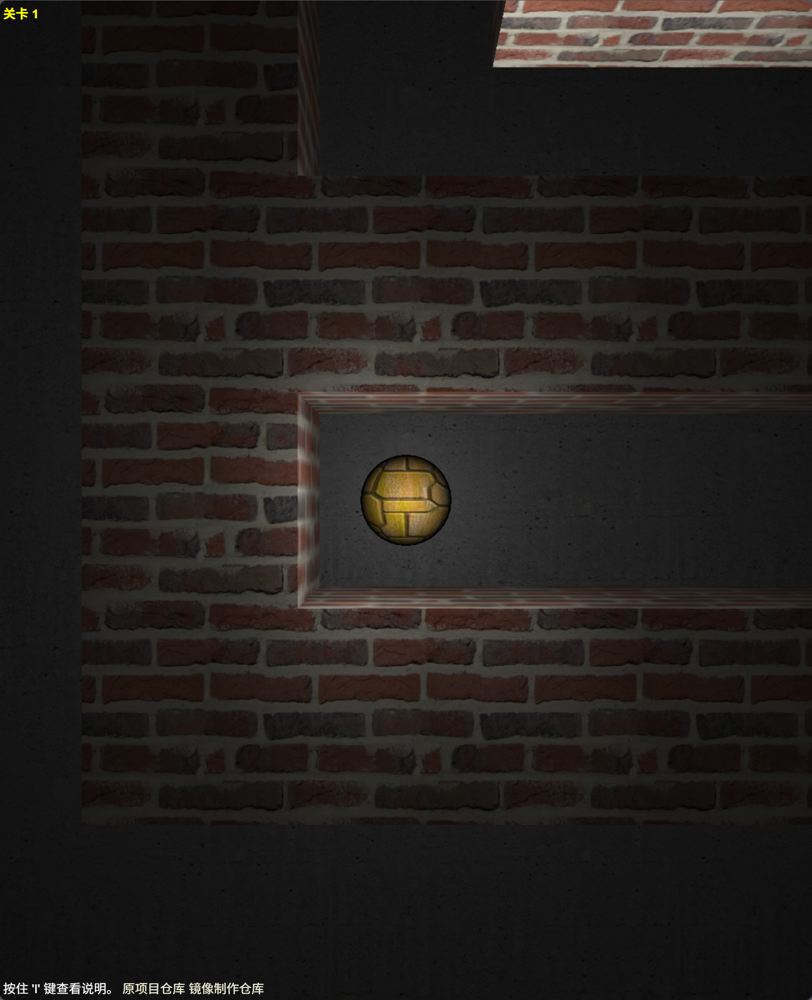

# Astray (迷途)

A WebGL maze game built with Three.js and Box2dWeb. Play it here: http://wwwtyro.github.io/Astray/  
一个使用 Three.js 和 Box2dWeb 构建的 WebGL 迷宫游戏。  
你可以在这里玩：http://wwwtyro.github.io/Astray/

## 部署说明

当前汉化仅适用于 版本：

首先感谢原作者的开源。[原项目地址]()

具体汉化了那些内容，请参考[翻译说明](./翻译说明.md)。

只做了汉化和简单修改，有问题，请到原作者仓库处反馈。

有需要帮忙部署这个项目的朋友,一杯奶茶,即可程远程帮你部署，需要可联系。  
微信号 `E-0_0-`  
闲鱼搜索用户 `明月人间`  
或者邮箱 `firfe163@163.com`  
如果这个项目有帮到你。欢迎start。

有其他的项目的汉化需求，欢迎提issue。或其他方式联系通知。

### 镜像

从阿里云或华为云镜像仓库拉取镜像，注意填写镜像标签，镜像仓库中没有`latest`标签

容器内部端口 3000

```bash
docker pull swr.cn-north-4.myhuaweicloud.com/firfe/astray:2025.05.03
```

### docker run 命令部署

```bash
docker run -d \
--name astray \
--network bridge \
--restart always \
--log-opt max-size=1m \
--log-opt max-file=3 \
-p 3000:3000 \
swr.cn-north-4.myhuaweicloud.com/firfe/astray:2025.05.03
```
### compose 文件部署 👍推荐

```yaml
#version: '3.9'
services:
  astray:
    container_name: astray
    image: swr.cn-north-4.myhuaweicloud.com/firfe/astray:2025.05.03
    network_mode: bridge
    restart: always
    logging:
      options:
        max-size: 1m
        max-file: '3'
    ports:
      - 3000:3000
```

## 修改说明

这里对除了汉化之外的代码修改的说明。  
增加修改部分具体见 [修改说明](./修改说明.md)。

`./README.md` 文件翻译，增加 `## 部署说明`、`## 修改说明`、`## 效果截图` 部分。

增加目录 `./图片`
新增文件 `./.dockerignore`、`./Dockerfile`、`./翻译说明.md`、`./修改说明.md`

## 效果截图




## Launching 启动方法

There are several ways to launch the game. Here is the simplest:  
有多种方式可以运行这个游戏。以下是其中最简单的一种：

1. Clone or download the repository  
   克隆或下载该仓库
2. Navigate to Astray's directory  
   进入 Astray 的项目目录
3. Start 'python -m SimpleHTTPServer' in your shell (for python 3.0 and above type 'python -m http.server' in your shell)  
   在终端中运行 python -m SimpleHTTPServer（如果是 Python 3.0 及以上版本，请运行 python -m http.server）
4. Open 'localhost:8000' in your browser  
   在浏览器中打开 localhost:8000
5. Enjoy! 开始享受游戏！
